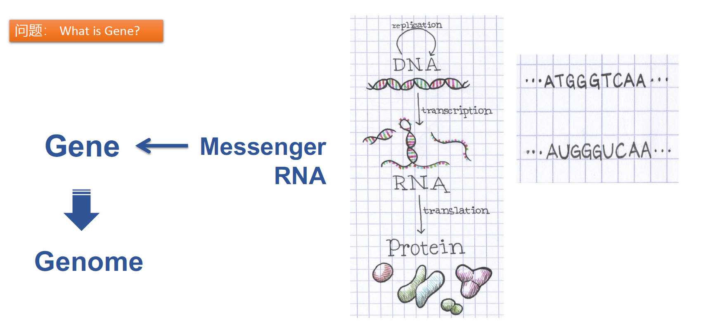

> 燕鸿伟/Hongwei Yan | Student ID: 2022312698

# 📚 Lecture 1

由于选课原因，未能直接参加第一节课的线下授课内容，因此本节课的授课笔记主要基于课件和雨课堂视频回放。

## 📝 Notes

### Introduction

> Decode the Language of Life: 对生命语言的解码
> `Science` 杂志创刊125周年时提出的前五个重要科学问题中两个，与生物信息学紧密相关：
>   - Why Do Humans Have So Few Genes?
>   - To What Extent Are Genetic Variation and Personal Health Linked?

#### 1. Gene

- Why Do Humans Have So Few Genes?
    - 25.3%的基因组部分不参与转录，剩下的74.7%中仅有2-3%会被翻译成蛋白质。
    - 人类的基因组既包含coding的部分，也包括non-coding的部分，其中coding相关的mRNA只占具有众多功能RNA家族中的一小部分。

#### 2. Method

> 测序和计算: Sequencing+Computing

- 2007-2008出现了二代测序技术，是一次测序能力技术革命，如今新的测序技术（如三代）已经出现
- 测序技术革命带来了大量的，高维的实验数据，这为数据挖掘的计算工具提出了更高的要求
- 生物信息学的三个步骤(完成三个目标)：
    1. 获取信息(Information): 医疗临床的或生物实验的数据，如影像图片、测序数据等
    2. 模型(Model): 常指**数学(包括基于概率和统计学的)模型**，如回归模型(regression model)、树模型(tree model)、神经网络模型(neural network)等。
    3. 算法(Algorithm): 用于实际**计算的工具**，如排序算法、动态规划算法等，包括编写出的用于计算机运行的程序。
- 生物信息学的两类特定问题：数据问题和生物学问题。

##### 🧭 模型和算法的区别

在定义上，模型是一类基于数学知识（包括统计学、概率论等学科）所构建出的用于解释或描述科学问题的通用概念，而算法是针对特定问题设计的用于直接使用和数据计算的工具。在使用上，应用模型需要具备相关学科的专业知识并对所研究的问题有充分理解，而使用算法工具则要求遵循流程化的标准规范。

### Getting Started

- Document your work
    - GitHub 开源平台管理项目
    - Markdown 语言用于记录工作
- Backup your work
    - 基础：使用云存储、系统自带的工具或GitHub来备份
    - 进阶：利用Liunx进程来自动服务器备份文件

### Setup

- 安装Docker软件并配置好对应的docker容器
- 使用文本编辑器(如linux自带的vim软件)
- 掌握基本的linux命令
    - `man`: 查询某一命令的具体参数，例如：man wget
    - `mkdir`: 创建文件夹
    - `cd`: 目录切换（注意区别相对路径与绝对路径）
    - `ls`: 显示文件夹中文件列表
    - `cat`: 直接查看文件
    - `wc`: 查看文件行数、字数
    - `cut`: 取出文件中的特定列或字符
    - `sort`: 排序
    - `uniq`: 去重复
    - `grep`: 文件中关键词搜索，返回行
    - `chmod`: 修改文件的访问权限

### Linux

与Windows, iOS, and Mac OS一样，Linux是一个操作系统。操作系统是一组主管并控制计算机操作、运用和运行硬件、软件资源和提供公共服务来组织用户交互的相互关联的系统软件程序。简单来说，操作系统是软件与硬件之间交流的桥梁。

- Linux和Unix的渊源(GNU: **G**NU’s **N**ot **U**nix): **L**inux **I**s **N**ot **U**niX
- Linux的两个主要分支: Fedora和Ubuntu
- Shell: 用户与Unix操作系统交互的界面。用户通过直接输入命令来执行各种各样的任务。Shell包围在kernel之外，用户通过shell将输入的指令与kernel沟通，从而使得kernel可以准确地控制硬件来进行工作。
- Bash: Linux的shell根据发展者的不同，有许多版本，比如Bourne Shell 、C Shell、K Shell等。Bash即Bourne Again SHell，是Bourne Shell（sh）的增强版本，在1987年由布莱恩·福克斯编写。它是GNU操作系统中重要的软件工具之一，目前也是GNU操作系统的基本shell。

#### 💡Tips in Bash

1. 命令记忆能力（history 上下键）
2. 命令和文件补全功能（[Tab]键）
3. 命令别名设置功能（alias）
4. 通配符（wildcard * ?）
5. 程序脚本（bash script）

------

## 📜 生物信息学：学习计划

### 课程期待

本学期我通过补退选成功选上了鲁志老师的《生物信息学实践》课程，我对本课程的学习抱有以下的期待：

- 对生物信息学关心的**科研问题**、使用的**研究方法**、在其他相关学科（如生物学、医学和药学等）领域中的**前沿热点**问题等有基本了解。
- 学习和使用生物信息学中使用的**数据处理、分析、计算的技能和编程技术**，如掌握Linux系统的基础操作、Bash和R语言的初步熟练使用等。
- 通过与老师和同学进行交流、阅读和探索相关书籍与文献，了解进行生物信息学相关研究的基本流程和科研思路，甚至进一步寻找学科交叉合作的可能性。

### 学习计划

结合我过往的科研经历，目前的研究方向和课业精力，我希望通过以下学习计划来完成相关目标：

1. 严格依照老师和助教的课程要求和教学安排完成课内学习任务。
2. 借助阅读老师推荐的教科书[《Bioinformatics Data Skills》](https://cloud.tsinghua.edu.cn/d/ad22768345664924b202/?p=%2FBooks%20and%20Education%20Papers%2FTextbook%20PDFs&mode=list)和相关教学文献来学习和掌握生物信息相关的学科知识（如经典模型背后的数学基础和概率计算等），并结合实际问题的计算实践进一步巩固数据处理和分析的技能。
3. 基于较好的计算机基础和曾经参与生物信息科研的经历，我希望能额外补充阅读近年来影响较大的生物信息科研工作，理解相关工作的基本方法和研究者的科研思路。
4. 通过课程中的经验分享这一部分，与老师和同学进行学科上的交流，结合时下大模型的火热来探讨它给生物信息学研究带来的机遇和挑战，同时也借助背景调研和思路总结的流程，加深自己对深度学习这一领域的理解和认知。